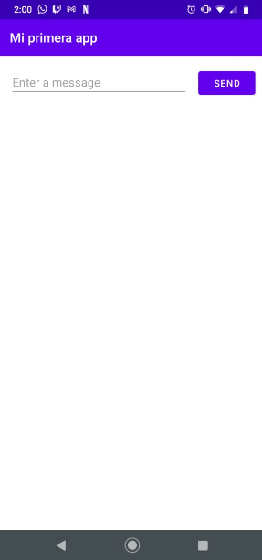
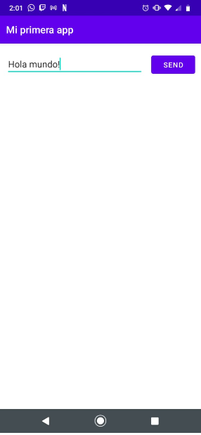
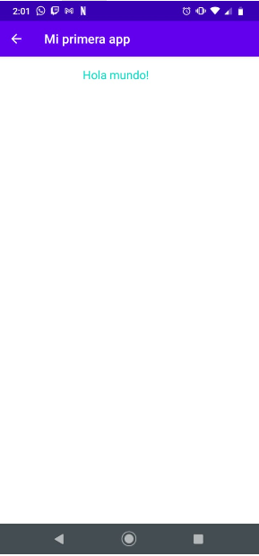

### Escuela Colombiana de Ingeniería
### Innovación y emprendimiento con TI

### Laboratorio 11 - Android - My first App

### Codigo de honor:
Debes seguir el Código de honor del ingeniero de sistemas para defender el estándar de integridad académica de la ECI:

* Tus respuestas a tareas, cuestionarios y exámenes deben ser tu propio trabajo (excepto para las tareas que permiten explícitamente la colaboración).

* No puedes compartir tus soluciones de tareas, cuestionarios o exámenes con otra persona a menos que el instructor lo permita explícitamente. Esto incluye cualquier cosa escrita por ti, como también cualquier solución oficial proporcionada por el docente o el monitor del curso.

* No puedes participar en otras actividades que mejorarán de manera deshonesta tus resultados o que mejorarán de manera deshonesta o dañarán los resultados de otras personas.

**Como compilarlo**

` Configura tu dispositivo de la siguiente manera:

Conecta el dispositivo a la máquina de desarrollo con un cable USB. Si desarrollaste una app en Windows, es posible que tengas que instalar el controlador USB apropiado para tu dispositivo.

Realiza los siguientes pasos a fin de habilitar la depuración de USB en la ventana Opciones para desarrolladores:

Abre la app de Configuración.

Si tu dispositivo usa Android 8.0 o una versión posterior, selecciona Sistema. De lo contrario, continúa con el paso siguiente.

Desplázate hasta la parte inferior y selecciona Acerca del teléfono.

Desplázate hasta la parte inferior y presiona Número de compilación siete veces.

Regresa a la pantalla anterior, desplázate hasta la parte inferior y presiona Opciones para desarrolladores.

En la ventana Opciones para desarrolladores, desplázate hacia abajo para buscar y habilitar la depuración de USB.

Ejecuta la app en tu dispositivo de la siguiente manera:

En Android Studio, selecciona tu app en el menú desplegable de configuraciones de ejecución/depuración de la barra de herramientas.

En la barra de herramientas, selecciona el dispositivo en el que deseas ejecutar la app desde el menú desplegable del dispositivo de destino.

Posteriormente haz clic en el boton  run

`

##  Cómo crear una interfaz de usuario sencilla

Despues de crear un nuevo proyecto en android studio, seremos capaces de visualizar una serie de paneles y de plantillas de diseños que permitiran ubicar los elementos deseados para la pagina deseada,
en esta ocasión crearemos un cuadro de texto y un botón con una alineación especifica entre si y entre los bordes, obeteniendo lo siguiente

## Cómo iniciar otra actividad

Una vez creados el cuadro de texto y el botón lo siguiente que debemos hacer es vincularlos entre si para que la información obtenida en el dialogo sea la que obtenemos en la siguiente actividad deseada

Despues de enviar cualquier mensaje lo deberiamos poder visualizar en una nueva pagina la cual lo mostrara en pantalla 

### Authors

* **Mateo González**  - [mateu20](https://github.com/mateu20)
